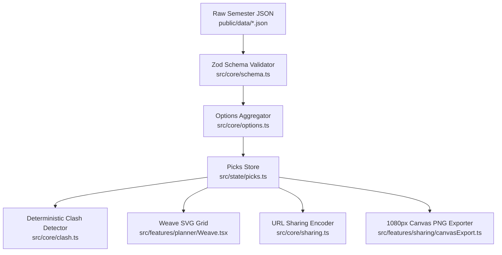

# NoClash Architecture Blueprint

## 1. Architectural Principles

NoClash is an opinionated, high-craft timetable mixer for university students with:
- **Zero External Backend or Database**: Static Single Page Application hosted on Render / GitHub Pages.
- **Pure Core Logic**: All math, interval overlap calculations, clash detection, and sharing payloads live in `src/core/` with 0 React/DOM dependencies and 100% branch test coverage.
- **Mobile First Apple Maps Split Layout**: Persistent Weave grid with a 3-snap draggable bottom sheet.
- **Offline First**: PWA with Service Worker precaching and automatic single-request caching in `localStorage`.

---

## 2. Component Pipeline



---

## 3. URL-Encoded Sharing Specification

Schedules are encoded directly in the URL:
```
loom.app/#/s/5/share/<payload>
```
- Payload format: Base64URL encoding of `{ s: semesterId, v: dataVersion, p: picks }`.
- Typical payload length: ~65–180 characters (well within all messaging platform limits).
- Non-destructive recipient preview: Opening a link loads in **Shared Preview Mode** (`[Use this schedule]` vs `[Keep my schedule]`), preventing accidental erasure of personal schedules.

---

## 4. Local Admin Studio Architecture

- Root: `admin/`
- Vite Server: Configured separately via `vite.admin.config.ts` on port 5174.
- Security: Never bundled into production `dist/` artifacts.
- Dev Hook: Custom Vite middleware plugin (`localDataWriterPlugin`) listening on `POST /api/save-timetable` writes verified JSON directly to the filesystem.
